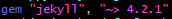
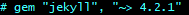
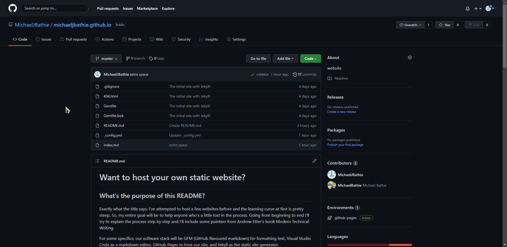
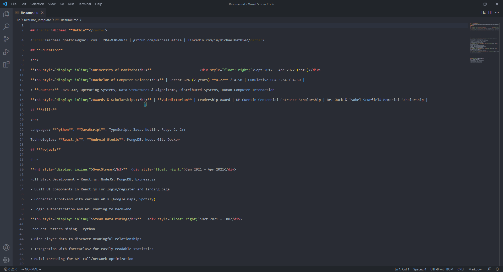

# Want to host your own resume?

## What's the purpose of this README?
Exactly what the title says. I've attempted to host a few websites before and the learning curve at first is pretty steep. So, my entire goal will be to help anyone a little lost in the process. Going from beginning to end I'll try to explain the process step by step and I'll include some pointers from Andrew Etter's book Modern Technical Writing. By the end of this you should be able to host your own static website using GitHub Pages, Markdown, Jekyll, and Visual Studio Code

For some specifics, our software stack will be GFM (GitHub flavored markdown) for formatting text, Visual Studio Code as a markdown editor, GitHub Pages to host our site, and Jekyll as the static site generator.

## What are these technologies?

If any of those terms confused you I'll give a brief explanation. Markdown is a lightweight markup language that allows you to format text. Visual Studio Code is simply a program to write text in with some nice features like markdown previews. Github is a version control system that basically keeps track of all the versions of our code. Github Pages has the server we will host our website on so we don't have to pay for a server or run it on our own machine. Finally, Jekyll will create a lightweight static website template for us that we can easily edit.

## Why are these choices significant?

We can justify these choices using the knowledge of Etter's book. First of all, you may ask why even host your resume on a website? Well, that's because everything goes out of date. If you distribute PDFs, they will eventually be out of date. If you direct someone to a website, you can always have the latest version there. It should also be mentioned that websites are easy to just update. Have something to add to your resume? The change will take 5 minutes. Another question may be, why use markdown? Well, it's portable. Markdown is supported in every web browser, every OS, basically everywhere. And it's free. Maybe you're questioning GitHub? This one's easy, you can literally go back in time. Ever lost a document because you forgot to save and delete it? Github has your back. It has a log of every commit you've ever made, and you can jump back to them whenever you want. Not to mention how it lets multiple devs work on the same thing without all the conflict hassle. Finally, maybe you don't think a static site with Jekyll is worth it. Well, you could spend 5 days making a lovely site, or spend 10 minutes getting a template for Jekyll. The faster it's up the more people see it. And then the static site portion, they're just faster. Your site doesn't have to worry about dynamically changing data from a database. Fewer network calls = good.


## Prerequisites
- GitHub account
- Resume formatted in Markdown (see More Resources to learn more about Markdown)
- Visual Studio Code --> [Click me to download!](https://code.visualstudio.com/)
- Latest devkit release of Ruby --> [Click me to download](https://rubyinstaller.org/downloads/)
    - This will install Ruby's package manager 'gem' for you. Open a command terminal and type: ```gem install bundler```
- GCC compiler --> [Follow this video tutorial](https://www.youtube.com/watch?v=sXW2VLrQ3Bs)
- Chocolatey package manager --> [Follow this video tutorial](https://www.youtube.com/watch?v=-5WLKu_J_AE)
    - Now use the command terminal again and type: ```choco install make```
- Git Bash --> [Click me to download](https://git-scm.com/download/win)

Final check! You should be able to type `ruby -v`, `gem -v`, `gcc -v`, `g++ -v`, and `make -v` without any errors in the command terminal. They should all return version numbers

## Instructions

### Create GitHub Repository 

This will essentially be a container to hold our code and keep track of its versions

<details><summary><b>Show Instructions</b></summary>

1. Go to github.com and navigate to "Your repositories"
2. From here create a new repository with the name YOUR-USERNAME.github.io
3. You now have the repository that will hold your website

</details>

### Setting up the site

Here we'll execute all the commands necessary to get the base site code in our local repository


<details><summary><b>Show Instructions</b></summary>

1. Open git bash and navigate to the folder your source files are stored in (if you already have a local copy) or where you want them to be stored (if you don't have a local copy).
   -  If you're unfamiliar with the command like you can use the ```ls``` command to list all the contents of the directory you're in and the ```cd DIRECTORY``` command to to 'change directory' into your desired directory.

        

<br>

2. Initialized your repository
    ```sh
        $ git init REPOSITORY-NAME
    ```
   - REPOSITORY-NAME is the name of *your* repository

<br>
 
3. ```cd``` into that new directory titled with your repository name and type:
    ```sh
        $ jekyll new --skip-bundle .
    ```
    - This creates a jekyll site in your current directory
    - Don't forget the period at the end of that command! It tells the command to be executed in the current directory.

<br>

4. Now we're going to make some changes to the Gemfile that was created. This can be done in one of two ways: use vim that comes with git bash (`vi Gemfile`), or just open it as a text file in your local folder structure. I recommend vim in the long term as it's a very powerful text editor, but has a steep learning curve. Try [this](https://www.openvim.com/) if you want to learn more.

<br>

5. Now that you have the file open add a `#` in front of the `gem "jekyll` line to comment it out.
   - Before: 
   - After:  

<br>

6. Now uncomment the `gem github-pages` line and change it to `gem "github-pages", "~> GITHUB-PAGES-VERSION", group: :jekyll_plugins` with GITHUB-PAGES-VERSION being the latest version of github-pages found [here](https://pages.github.com/versions/)
    - Before: 
    - After: 
      - Here, 219 was the latest version. It might be different for you

<br>

7. Save and close that. Back in your git bash instance in your repository's directory type:
    ```sh
        $ bundle install
    ```

</details>

### Getting our site on github

Here we're moving all our code onto github so others can see and github can begin hosting our new site!

<details><summary><b>Show Instructions</b></summary>

1. Start tracking all of the changes. From your repository's directory:
    ```sh
        $ git add .
    ```
    - Again, remember the '.'.
    - This command will start tracking all the changes in the current directory
  
<br>

2. Tell git that you want to bundle all of your current changes
    ```sh
        $ git commit -m 'Initial Jekyll site'
    ```
    - The '-m' and string there are saying we watch to attach this message to the commit

<br>

3. Now tell GitHub that this folder is going to be a remote repository.
    ```sh
        $ git remote add origin https://github.com/USER/REPOSITORY.git
    ```
    - USER is your username
    - REPOSITORY is the name of your repository

<br>

4. Time to actually move and save those change onto GitHub.
    ```sh
        $ git push -u origin BRANCH
    ```
    - Branch will be the name of your latest stable version. Convention is normally 'main' or 'master'.

</details>

### Testing the site

Let's see if our site is being hosted and rendered correctly

<details><summary><b>Show Instructions</b></summary>

1. Go to your repository on github.com then Settings>Pages> and there should be a link to your website



</details>

### Configuring the website

Now we'll be focusing on what's on the website and some things you can change. From here on we can simply work from the github repository on github.com to make things a bit easier

<details><summary><b>Show Instructions</b></summary>

1. First lets make sure the resume is formatted correctly in markdown. Open your markdown resume in Visual Studio Code and preview the markdown
    
    

<br>

2. To get your resume on the homepage open up index.markdown, click edit, and replace everything there with your resume

<br>

3. Change the values in _config.yml that you want to change
    - This includes things like the website title and description. All are labelled in the _config.yml file

<br>

4. Your website should now properly display your resume. Check back at the link in Settings>Pages to see!
    - Sometimes it may take a bit to update, if nothing it happening try to give it ~5 minutes

</details>

### Themeing the site

I'll show you how to add a simple theme

<details><summary><b>Show Instructions</b></summary>
    
1. Go to your GitHub repository and navigate to the location where you found your site link before
    - Settings>Pages
    
<br>
    
2. Click the "Change Theme" button
    
<br>
    
3. Select one of the themes at the top of the page and click the "Select Theme" button
    - You may run into a problem where your website just turns white, see FAQs for more information
    
</details>

<br>

## More Resources
- [Markdown tutorial](https://www.markdowntutorial.com/)
- [Jekyll tutorial](https://www.youtube.com/playlist?list=PLLAZ4kZ9dFpOPV5C5Ay0pHaa0RJFhcmcB)
- [Vim tutorial](https://www.openvim.com/) 
- [Etter's Modern Technical Writing](https://www.amazon.ca/Modern-Technical-Writing-Introduction-Documentation-ebook/dp/B01A2QL9SS)

<br>

## Authors and Acknowledgments
I am the one who wrote this documention (Michael Bathie). Special thanks to my group members Faith De Leon, Koye Fatoki, Tuan Le, and Andy Tan for help with the peer editing process. Thanks to the authors of github-pages' [slate theme](https://github.com/pages-themes/slate). And of course thanks to Andrew Etter for providing the knowledge of the great importance of these steps

<br>

## FAQ
Q: Can I host the website on my own machine for testing?  
A: Yes you can! Just use the command terminal to navigate into you project repository and type:  

    $ bundle exec jekyll serve

- The site should now be deployed on http://127.0.0.1:4000/
- <span style="color:red">NOTE:</span> you may need to change the 'theme' tag in _config.yml to 'remote_theme' and change the value to the github repository. But generally this is only needed for third-party themes

<br>

Q: Why is my website a blank page after changing the theme?  
A: What likely happned is your website before the themes change used certain layouts (say a 'home' layout) while the new themes doesn't use that layout (say it uses 'index'). Go to the github page of the theme and see what layouts they use. 
- I'll also direct you to the Jekyll tutorial in [More Resources](#more-resources) to learn more about layouts
    
